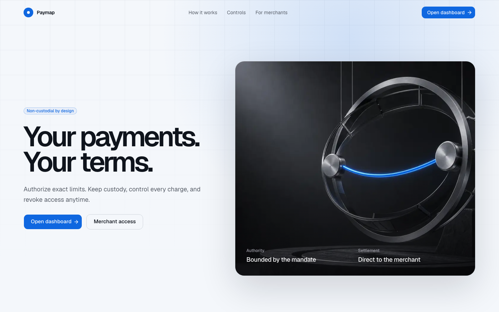
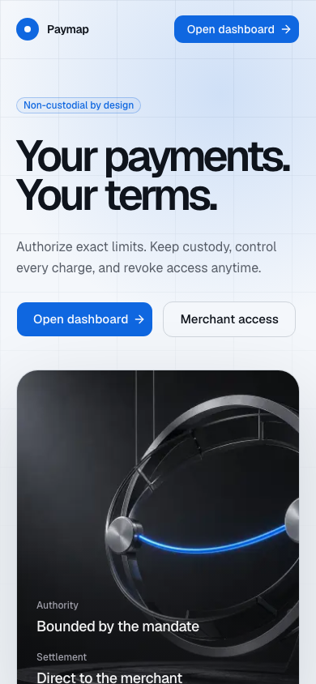
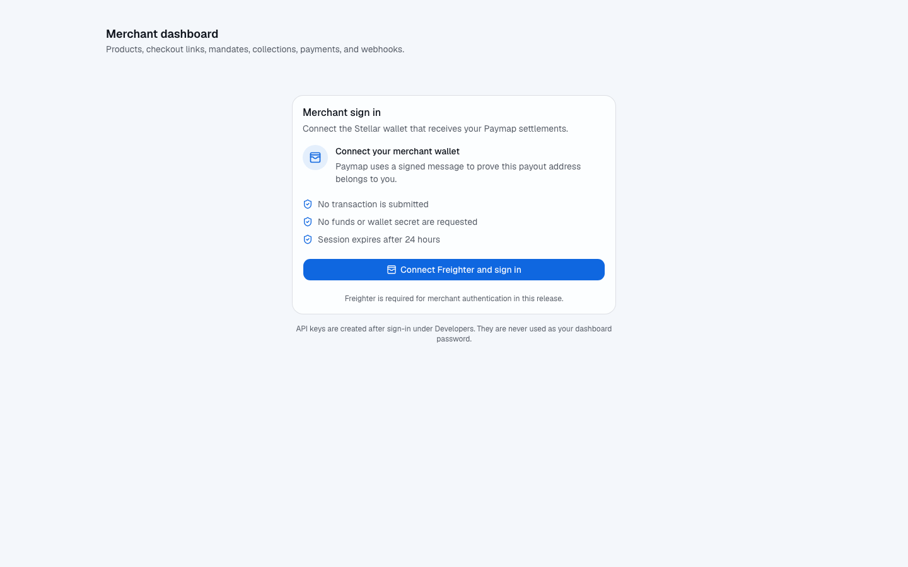
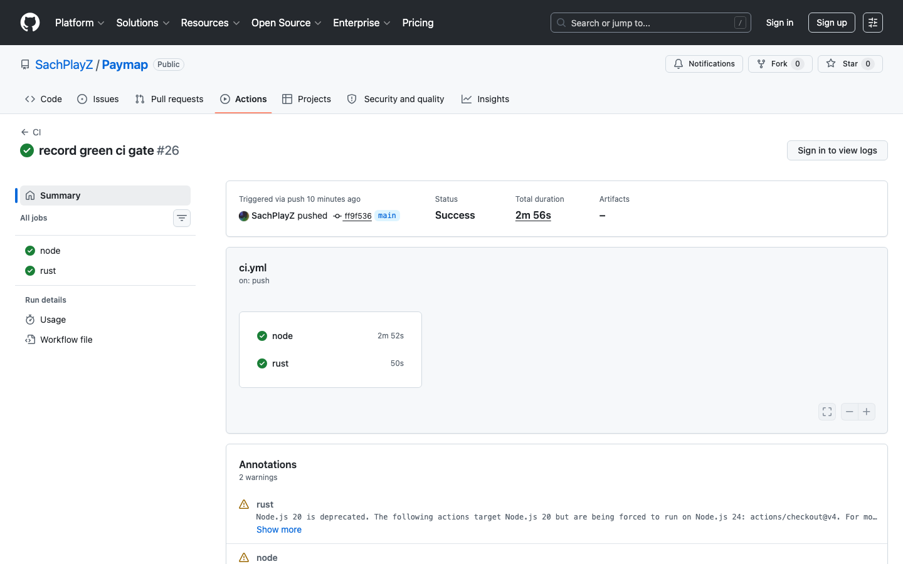
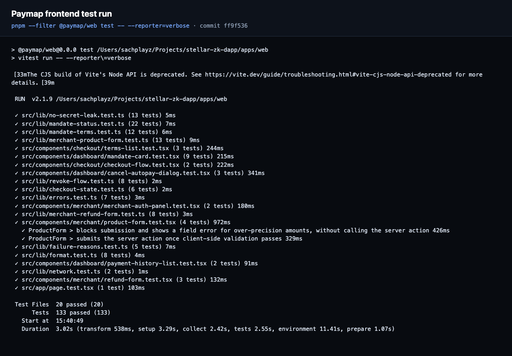
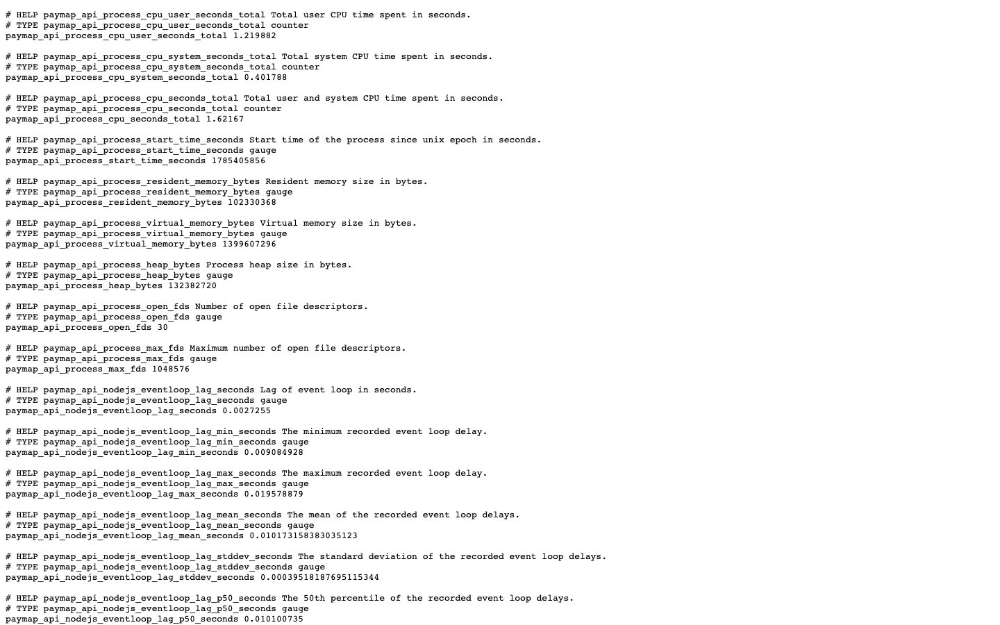
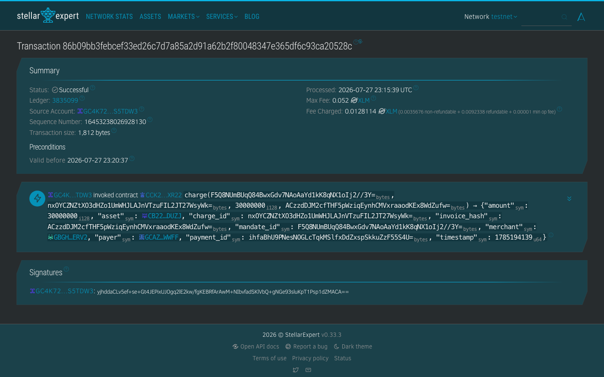

# Stellar Mandates

Recurring stablecoin payments with limits enforced by a Soroban contract. Payers authorize a bounded mandate and token allowance; merchants can collect only within the signed amount, time, frequency, and charge-count rules. Payers can pause or revoke immediately.

## Submission readiness

> [!IMPORTANT]
> The technical product evidence is ready. The submission is **not yet fully Level 4 or Level 5
> compliant** because genuine user responses, the public demo video, and team review have not been
> supplied. Controlled stress wallets are never counted as real users.

| Item                           | Status        | Evidence                                                                                                                            |
| ------------------------------ | ------------- | ----------------------------------------------------------------------------------------------------------------------------------- |
| Public repository              | Ready         | <https://github.com/SachPlayZ/Paymap>                                                                                               |
| Meaningful commits             | Ready         | 38 commits before this audit; requirements are 15+ / 20+                                                                            |
| Live application               | Ready         | <https://paymap-web.vercel.app>                                                                                                     |
| Live API and monitoring        | Ready         | [Readiness](https://paymap-demo-api.onrender.com/readyz) · [Prometheus metrics](https://paymap-demo-api.onrender.com/metrics)       |
| Testnet contract               | Ready         | `CCK2CG2DOZ7II4DTTNABU54F3OFMMJRKNABXLPTWINKXPWNMS2Q3XR22`                                                                          |
| Contract interaction           | Ready         | [`charge` transaction](https://stellar.expert/explorer/testnet/tx/86b09bb3febcef33ed26c7d7a85a2d91a62b2f80048347e365df6c93ca20528c) |
| CI/CD                          | Ready         | [Green `main` workflow](https://github.com/SachPlayZ/Paymap/actions/runs/30534296778)                                               |
| Pitch deck                     | Ready         | [Download the professional Level 5 deck](docs/level-5/Paymap-Level-5-Pitch-Deck.pptx)                                               |
| Testnet activity               | Ready         | [52 verified transactions](docs/level-5/evidence/testnet-stress-20260730045306-585217.csv)                                          |
| Feedback workbook              | Template only | [Formula-backed workbook; currently 0 responses](docs/level-5/Paymap-User-Feedback-Analysis.xlsx)                                   |
| Google Form                    | Pending       | [Exact form specification](docs/level-5/google-form-spec.md); authenticated form creation still required                            |
| Demo video                     | Pending       | [Recording script](docs/demo-script.md); public video URL still required                                                            |
| Genuine user cohort            | Pending       | 10 real users for Level 4; 50 verified users for Level 5                                                                            |
| Feedback-driven product commit | Pending       | Must be selected from genuine feedback; it will not be fabricated                                                                   |
| Team review                    | Pending       | [Review rubric and sign-off sheet](docs/team-review.md)                                                                             |

The exhaustive Level 4, Level 5, and technical requirement matrix is in
[`docs/level-5/submission-evidence.md`](docs/level-5/submission-evidence.md).

### Screenshots

| Production UI                                                                   | Mobile responsive UI                                                       |
| ------------------------------------------------------------------------------- | -------------------------------------------------------------------------- |
|  |  |



| Green CI/CD                                                               | Frontend tests                                                       |
| ------------------------------------------------------------------------- | -------------------------------------------------------------------- |
|  |  |

| Live monitoring                                                          | Testnet transaction                                                                            |
| ------------------------------------------------------------------------ | ---------------------------------------------------------------------------------------------- |
|  |  |

Screenshot sources and capture details are recorded in
[`docs/level-5/evidence/README.md`](docs/level-5/evidence/README.md).

### Testnet activity proof

- [`create_mandate` transaction](https://stellar.expert/explorer/testnet/tx/8e03653aeddaae57aa8f24176f2f5d51c395356fb97b1c8d75e3166ffbefd5d8)
- [Relayer-submitted `charge` transaction](https://stellar.expert/explorer/testnet/tx/86b09bb3febcef33ed26c7d7a85a2d91a62b2f80048347e365df6c93ca20528c)
- [52-transaction stress run](docs/level-5/evidence/testnet-stress-20260730045306-585217.csv):
  12 controlled addresses, 7 mandates, and 7 production-relayed charges; every hash is successful
  in Horizon. This is technical load evidence, not real-user proof.
- System E2E evidence and transaction context: [`docs/architecture.md`](docs/architecture.md)

### User feedback and next-phase improvement plan

Genuine responses must be collected with the specified Google Form, exported into the workbook,
and paired with verified testnet transactions. Names and emails must be redacted before public
publication.

After collection:

1. Group onboarding and product feedback by theme.
2. Rank themes by frequency, severity, and affected user flow.
3. Implement the highest-impact onboarding or stability issue.
4. Link the implementation commit and before/after evidence here.
5. Re-run the same user flow and measure rating, completion, and verified-transaction changes.

The evidence workflow, workbook, deck, and form specification were added in
[commit `adf30fd`](https://github.com/SachPlayZ/Paymap/commit/adf30fd). The first
feedback-driven product commit remains pending real responses and will be linked here.

## Deployed testnet contract

| Item                   | Value                                                              |
| ---------------------- | ------------------------------------------------------------------ |
| Network                | Stellar testnet                                                    |
| Mandate registry       | `CCK2CG2DOZ7II4DTTNABU54F3OFMMJRKNABXLPTWINKXPWNMS2Q3XR22`         |
| Optimized Wasm SHA-256 | `8b4f68e3f1ecb259d7cbb7153032ac8afbd279d1c5d4eb82ee0896c935e2832c` |
| Demo asset             | PUSD, 7 decimals                                                   |
| PUSD SAC               | `CB223VUC7MMCFT352EO7QLLV6QWHXTDOXOHY2BW7DZTO3VXBXAI7DUZJ`         |
| Deployment record      | [`deployments/testnet.json`](deployments/testnet.json)             |

The deployment script builds optimized Wasm, deploys the registry and PUSD Stellar Asset Contract, and writes the public registry:

```bash
pnpm --filter @paymap/scripts deploy:testnet
```

## Clean demo setup

Prerequisites: Node 22+, pnpm 10.12.1, Rust, Stellar CLI 23+, Docker, and Freighter or xBull set to testnet.

From a clean clone:

```bash
pnpm install --frozen-lockfile
pnpm demo:setup
pnpm start
```

`demo:setup` creates a mode-0600 gitignored `.env` without printing secrets, starts Postgres/Redis, migrates the DB, builds all workspaces, funds named testnet identities, establishes PUSD trustlines, and seeds:

- CloudBox merchant
- demo consumer
- fixed `20 PUSD / 30 days` plan
- variable `15 PUSD / charge, 50 PUSD / 30 days` plan
- fresh checkout links at `/checkout/demo-fixed-checkout` and `/checkout/demo-variable-checkout`

Open [http://localhost:3000](http://localhost:3000). `pnpm demo:setup` refuses to overwrite an existing `.env`.

Run the four real-testnet protection scenes:

```bash
pnpm demo:scenes
```

This executes one successful charge, rejects an over-limit charge, revokes the mandate, then rejects an otherwise-valid post-revocation charge. Transaction hashes and stable contract error names are printed; secret keys are not.

## Wallet and contract integration

`apps/web` uses Stellar Wallets Kit with Freighter and xBull. The wallet adapter supplies both transaction and Soroban authorization-entry signing. No private key enters browser source.

Frontend contract calls are real `@stellar/stellar-sdk` flows:

| UI flow                | Contract/SAC function                                                                |
| ---------------------- | ------------------------------------------------------------------------------------ |
| Checkout               | `create_mandate`, SAC `allowance`, SAC `approve`                                     |
| Consumer dashboard     | `get_mandate`, `pause_mandate`, `resume_mandate`, `revoke_mandate`, SAC `approve(0)` |
| Relayer                | `charge`, `get_mandate`                                                              |
| Refund pipeline/client | `refund`, `get_payment`, `get_refund`, `get_refunded_total`                          |

Generated bindings expose all 11 deployed mandate-registry functions. The hand-written facade converts every on-chain integer to `bigint`; API money remains decimal strings.

Key files:

- `apps/web/src/lib/wallet.ts`
- `apps/web/src/lib/chain-gateway.ts`
- `apps/web/src/lib/mandate-gateway.ts`
- `packages/contract-client/src/generated/mandate-registry.ts`
- `packages/stellar/src/submit.ts`

## Verification

```bash
pnpm lint
pnpm typecheck
pnpm test
pnpm test:e2e
pnpm test:e2e:system
pnpm build

cargo fmt --all -- --check
cargo clippy --workspace --all-targets -- -D warnings
cargo test --workspace
stellar contract info interface \
  --id CCK2CG2DOZ7II4DTTNABU54F3OFMMJRKNABXLPTWINKXPWNMS2Q3XR22 \
  --network testnet
```

`test:e2e:system` uses ephemeral test-only wallets and the committed testnet
deployment to prove checkout, charge, signed webhook delivery, payment history,
revocation, allowance removal, and typed `MandateRevoked` rejection. It never
uses production signer configuration.

Architecture, invariants, merchant API, threat model, and exact demo narration live in [`docs/`](docs/).

## Security boundary

The Soroban contract is policy authority. API, DB, and relayer state cannot override mandate
limits or revocation. Merchants sign an exact, bounded Soroban authorization entry; the API
validates and encrypts it, and the relayer attaches it without holding a merchant secret. API
keys are route-scoped. Prometheus/Alertmanager/Grafana deployment and operations are documented in
[`docs/operations.md`](docs/operations.md).
